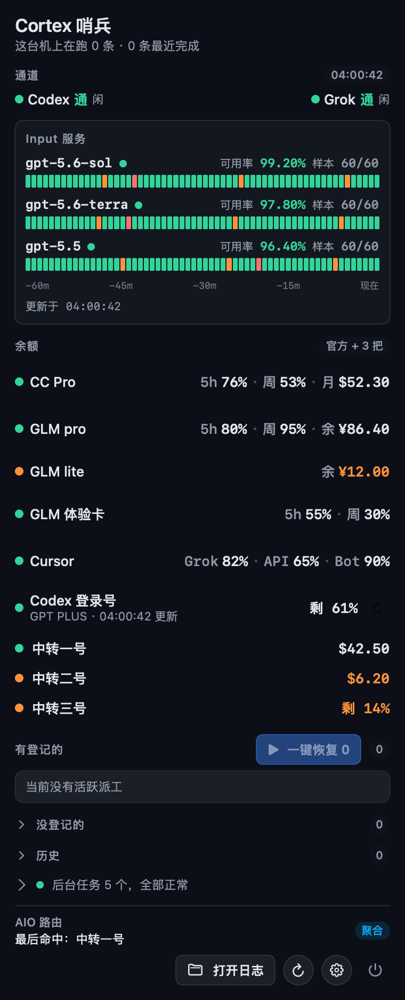
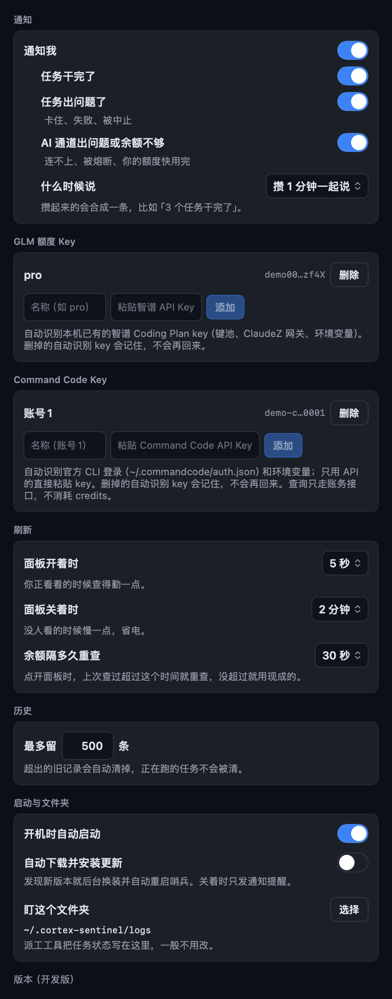

# Cortex 哨兵

macOS 菜单栏应用。盯着 AI 编码任务是否在跑、通道是否通、各家订阅额度和余额还剩多少。Swift + SwiftUI，单二进制，无第三方依赖。

<p align="center">
  
  &nbsp;
  
</p>

## 面板

- **通道**：Codex / Grok 通断红绿灯
- **Input 服务**：三个模型各一行 60 格历史条，绿通、橙慢、红挂
- **余额**：GLM、Command Code、Cursor、GPT 官方、AIO 密钥池，各一块
  - 数字是剩余额度（像电量），行下的横条是时间流逝，越接近重置越黄越红
  - 行首彩色点：综合 5 小时窗、周窗、余额的状态灯（黄=告急、红=见底）
  - 被派工侧认成套餐的 GLM 行：行名用套餐名，第三列换成在跑/冷却，额度状态灯不看现金
  - 悬停任意行出详情卡：用量、重置时间、更新时间
  - 按住状态点上下拖，组内排序；点行名字直接改名
- **派工线**：监视目录里的任务状态，正在跑、卡住、重拉次数一目了然
- **通知**：收工、出问题、通道断、余额吃紧，频率可调

## 设置

点面板右下角齿轮。API Key 配置在最上面（GLM、Command Code，粘贴即用），往下是通知、刷新频率、历史保留、自启动和自动更新。

## 自动更新

每小时查一次 GitHub Releases，新版本后台静默下载校验，面板右上角一键换装重启；设置里可以打开全自动。包必须 Developer ID 签名 + 公证，校验不过直接放弃。

## 安装

到 [Releases](../../releases) 下载公证过的 `.dmg`，拖进「应用程序」。从源码装：

```bash
bash scripts/install-app.sh
```

## 开发

```bash
swift build         # 编译
swift test          # 全量单元测试
bash scripts/build-release.sh   # 签名 + 公证 + DMG
```

改面板后的真机验收：`./.build/debug/CortexSentinelBar --render-live-panel-png /tmp/panel.png`。更多调试入口和运维踩坑见 [docs/](docs/)。
